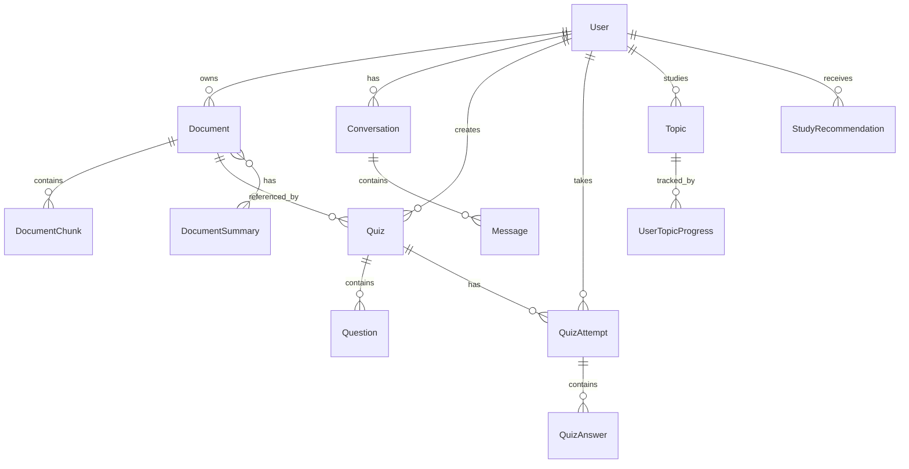
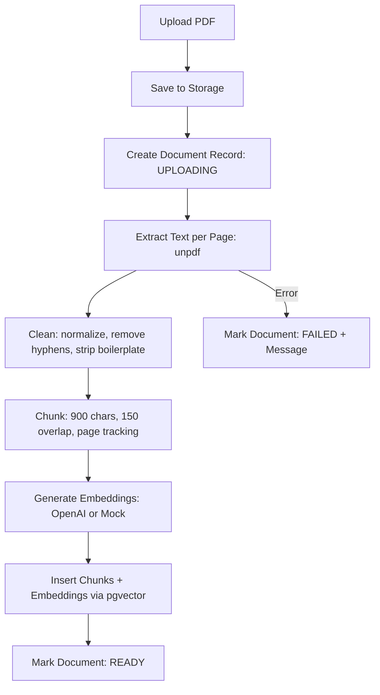
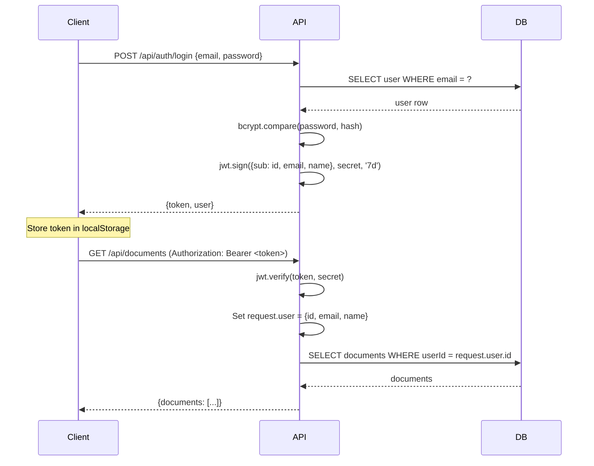
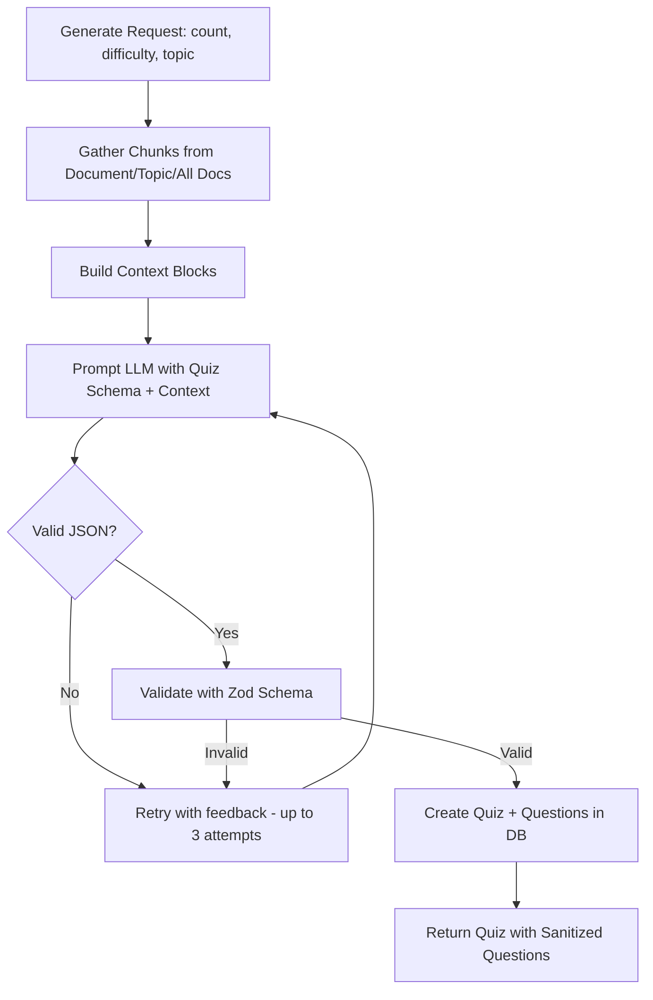
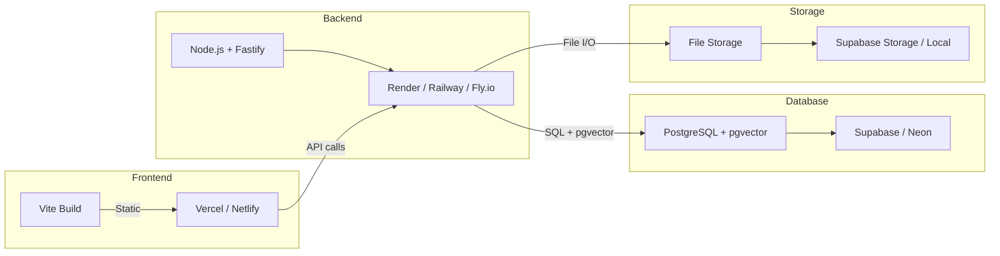

# StudyForge AI — Architecture Documentation

## System Overview

StudyForge AI follows a clean three-tier architecture: Frontend → Backend → Database, with AI services abstracted behind provider interfaces.

```
┌─────────────────────────────────────────────────────────┐
│                      Browser (SPA)                       │
│  React + Vite + Tailwind + TanStack Query + React Router │
└────────────────────┬────────────────────────────────────┘
                     │ HTTP/REST + SSE (streaming)
                     ▼
┌─────────────────────────────────────────────────────────┐
│                  Backend (Fastify + Node.js)              │
│                                                          │
│  ┌──────────┐  ┌──────────┐  ┌──────────┐  ┌─────────┐ │
│  │  Auth     │  │ Documents│  │   Chat   │  │ Quizzes │ │
│  │  Routes   │  │  Routes  │  │  Routes  │  │ Routes  │ │
│  └────┬─────┘  └────┬─────┘  └────┬─────┘  └────┬────┘ │
│       │              │              │              │      │
│  ┌────▼─────┐  ┌────▼─────┐  ┌────▼─────┐  ┌────▼────┐ │
│  │  Auth    │  │ Documents│  │   Chat   │  │  Quiz   │ │
│  │ Service  │  │ Service  │  │ Service  │  │ Service │ │
│  └──────────┘  └────┬─────┘  └────┬─────┘  └─────────┘ │
│                     │              │                      │
│                ┌────▼─────┐  ┌────▼─────┐                │
│                │ Document │  │   RAG    │                │
│                │Processor │  │ Pipeline │                │
│                └────┬─────┘  └────┬─────┘                │
│                     │              │                      │
│                ┌────▼─────┐  ┌────▼─────┐                │
│                │ Vector   │  │ Retriever│                │
│                │  Store   │  │(vec/kw)  │                │
│                └──────────┘  └──────────┘                │
│                                                          │
│  ┌──────────────────────────────────────────────────┐   │
│  │              AI Provider Layer                     │   │
│  │  ┌──────────────┐    ┌──────────────────────┐    │   │
│  │  │ OpenAI        │    │ Mock (Offline)        │    │   │
│  │  │ - Chat LLM    │    │ - Extractive Chat     │    │   │
│  │  │ - Embeddings  │    │ - Keyword Retrieval   │    │   │
│  │  └──────────────┘    │ - Hash Embeddings      │    │   │
│  │                       └──────────────────────┘    │   │
│  └──────────────────────────────────────────────────┘   │
└────────────────────┬───────────────────────┬────────────┘
                     │                       │
              ┌──────▼──────┐        ┌───────▼──────┐
              │ PostgreSQL  │        │ File Storage  │
              │ + pgvector  │        │ (local/S3)    │
              └─────────────┘        └──────────────┘
```

## Database Architecture

### Entity Relationship Diagram



### Key Models

| Model | Purpose |
|-------|---------|
| User | Authentication and account management |
| Document | Uploaded file metadata, status, summary |
| DocumentChunk | Chunked text with page numbers, embeddings |
| Conversation | Chat session container |
| Message | Individual chat messages with citations |
| Quiz | Quiz configuration |
| Question | Individual quiz questions with options and explanations |
| QuizAttempt | A quiz submission record |
| QuizAnswer | Individual answer in an attempt |
| Topic | Unique topic names per user |
| UserTopicProgress | Accuracy tracking per topic per user |
| StudyRecommendation | Generated personalized recommendations |

### pgvector Integration

The `DocumentChunk` model has an `embedding` field using PostgreSQL's `vector(1536)` type, managed via Prisma's `Unsupported("vector(1536)")` type and raw SQL for inserts and queries.

Cosine similarity search:
```sql
SELECT c.*, 1 - (c.embedding <=> $1::vector) AS similarity
FROM "DocumentChunk" c
JOIN "Document" d ON d."id" = c."documentId"
WHERE d."userId" = $2 AND d."status" = 'READY'
ORDER BY c.embedding <=> $1::vector
LIMIT $3
```

An `ivfflat` or `hnsw` index can be created for production-scale deployments.

## RAG Pipeline

### Document Processing Flow



### RAG Answer Flow

```mermaid
flowchart TD
    A[User Question] --> B[Generate Query Embedding]
    B --> C[Search pgvector: Top 6 Chunks]
    C --> D{Chunks Found?}
    D -->|No| E[Return: "Not found in your material"]
    D -->|Yes| F[Build Numbered Context Blocks]
    F --> G[Construct LLM Prompt with System Rules]
    G --> H[Send to LLM with Context + History]
    H --> I[Parse [n] Citation Markers]
    I --> J[Map Citations to Document/Page/Excerpt]
    J --> K[Return Answer + Citations]
```

### Offline Mode (Mock)

When `LLM_PROVIDER=mock` or `EMBEDDING_PROVIDER=mock`:
- **Retrieval**: Keyword ranking with TF scoring (no vector search needed)
- **Chat**: Extractive — picks highest-scoring sentences from retrieved chunks
- **Quiz Generation**: Parses definitions from context, builds MCQs deterministically
- **Summaries**: TF-based extraction of overview, concepts, definitions

This allows the entire application to run without any API keys.

## Authentication Flow



## Quiz Generation Flow



## Deployment Architecture



## Design Decisions

1. **Mock providers**: Every feature works offline for demos. No API keys required to run the full flow.
2. **pgvector over external vector DB**: Single database reduces operational complexity for a hackathon project.
3. **In-process job queue**: Document processing runs asynchronously in the same process. Sufficient for hackathon scale; production would use Bull/BullMQ + Redis.
4. **Extractive mock LLM**: Rather than template-based nonsense, the mock provider extracts real sentences from the student's documents — making demos genuinely useful.
5. **Zod validation for AI output**: Structured AI responses are validated with schemas, not parsed from free-form text.
6. **Citations parsed from [n] markers**: The LLM is instructed to cite sources with bracket numbers, which are parsed and mapped to document/page metadata.
